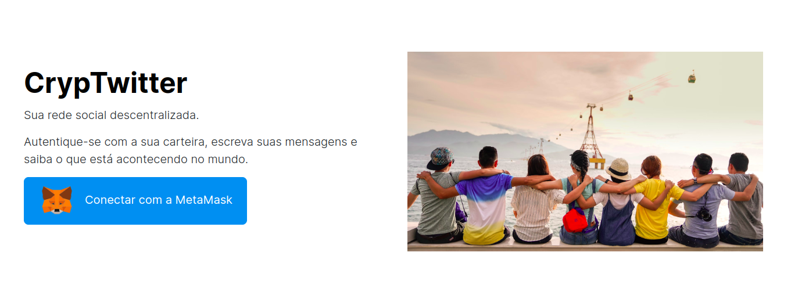

# Web3Week

<h1 align="center"> CrypTwitter web3 frontend. </h1>


<h1 align="center" >
  
</h1>


## smart-contract
access smart-contract folder file CrypTwitter.sol.

## Technologies

- [Next.js](http://nextjs.org)
- [Solidity](https://soliditylang.org/)
- [Metamask](https://metamask.io/)


## Run project

Clone the project and access the folder.

```bash
$ git@github.com:ThiLourenco/Web3Week.git
$ cd dapp
```
Requirements

- [Node.js](https://nodejs.org/en/)
- Package Manage ([Npm](https://www.npmjs.com/) or [Pnpm](https://pnpm.io/pt/))

Follow the steps below:

If you have your contract deployed, change his address at services/Web3Service.js and your ABI.json, verify .env.example

```bash
# Install the dependencies
$ npm or pnpm i
# Start the project
$ pnpm dev or npm run dev
```

The app will be available for access on your browser at http://localhost:3000


## 📝 License

This project is licensed under the MIT License. See the [LICENSE](LICENSE) file for details.

---

<p align="center">Create by <a href="https://github.com/thilourenco">Thiago Lourenço</a></p>